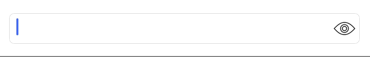

## RevealTextField



[](https://github.com/LeonardoCardoso/RevealTextField#requirements-and-details)
[](https://github.com/LeonardoCardoso/RevealTextField#cocoapods)
[](https://github.com/LeonardoCardoso/RevealTextField#carthage)

> Simple extension to add a reveal button to your boring UITextField

- [Requirements](#requirements)
- [Installation](#installation)
- [Usage](#usage)
- [License](#license)

## Requirements

- iOS 8.0+
- Swift 3.0+
- Xcode 8.0+

## Installation

### CocoaPods

[CocoaPods](http://cocoapods.org) is a dependency manager for Cocoa projects. You can install it with the following command:

```bash
$ gem install cocoapods
```

> CocoaPods 1.1.0+ is required to build RevealTextField 1.0.3+.

To integrate RevealTextField into your Xcode project using CocoaPods, specify it in your `Podfile`:

```ruby
source 'https://github.com/CocoaPods/Specs.git'
platform :ios, '8.0'
use_frameworks!

pod 'RevealTextField', '~> 1.0.3'
```

Then, run the following command:

```bash
$ pod install
```

### Carthage

[Carthage](https://github.com/Carthage/Carthage) is a decentralized dependency manager that automates the process of adding frameworks to your Cocoa application.

You can install Carthage with [Homebrew](http://brew.sh/) using the following command:

```bash
$ brew update
$ brew install carthage
```

To integrate RevealTextField into your Xcode project using Carthage, specify it in your `Cartfile`:

```ogdl
github "LeonardoCardoso/RevealTextField" ~> 1.0.3
```

### Manually

If you prefer not to use either of the aforementioned dependency managers, you can integrate RevealTextField into your project manually.

## Usage

You can use a `RevealTextField` on any `UITextField` by just calling the function `revealable()`. Yes it's an **extension**, not a *subclass*:

```swift
let passwordTextField = UITextField()
passwordTextField.isSecureTextEntry = true
passwordTextField.revealable() // <<---
```

### Customizing

```swift
passwordTextField.revealable(secureImage: UIImage?,     // <<--- isSecureTextEntry == true. 
                             unsecureImage: UIImage?,   // <<--- isSecureTextEntry == false.
                             tintColor: UIColor?,       // <<--- image color, default is black.
                             dimension: CGFloat?)       // <<--- image dimension, default is 30.
```

### Functions

- `revealable()` transforms your boring `UITextField` into a **Revealing** `UITextField`.
-  `toggleReveal()` toggles the review automatically at any time. It applies to every `UITextField`.
- `toggleImage(_ isSecure: Bool)` toggles revealing image at any time.
   
## License

RevealTextField is released under the MIT license. See [LICENSE](https://github.com/LeonardoCardoso/RevealTextField/blob/master/LICENSE) for details.

### Follow me for the latest updates
<a href="https://goo.gl/UC8B8o"></a>
